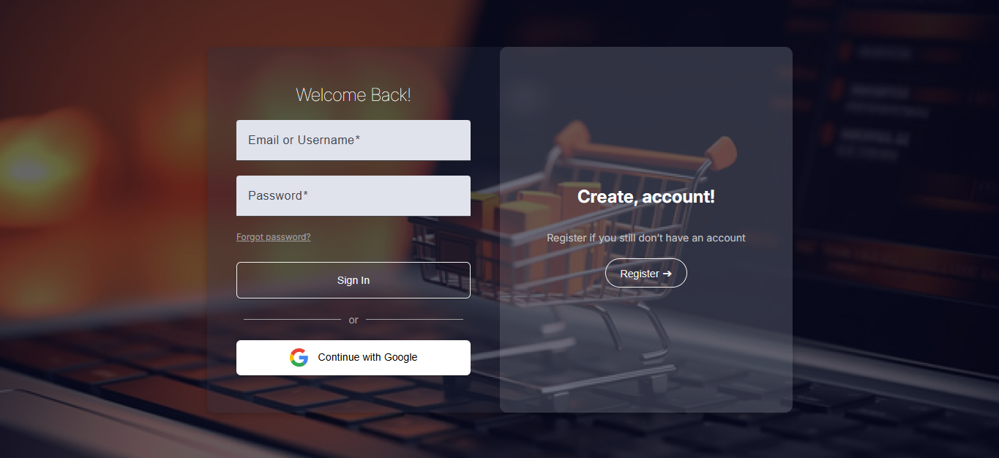
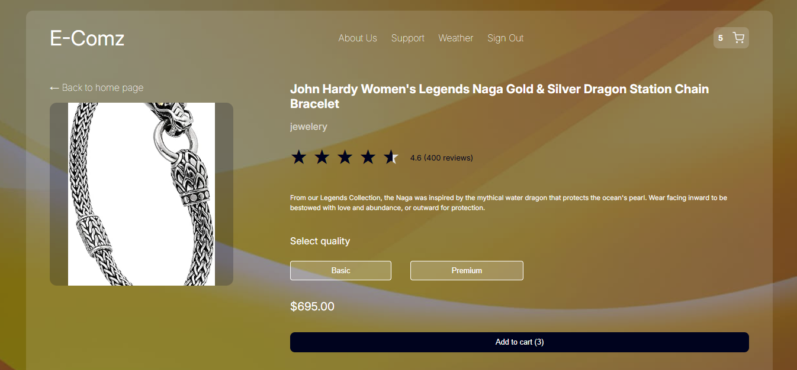

# EComz

EComz is an e-commerce platform built as part of an assessment project with the company ITXI. The purpose of this project is to demonstrate skills in Angular development, creating a functional, responsive, and user-friendly online store. The project includes core e-commerce functionalities such as product listings, detailed product views, and user authentication, integrating with the FakeStore API for product data.

## Project Overview

This project was generated with [Angular CLI](https://github.com/angular/angular-cli) version 18.2.11. EComz utilizes the latest Angular practices, aiming to provide a seamless shopping experience for users.


### User Screens (Web)

| Login screen                                | Register screen                            |
| ------------------------------------------- | ----------------------------------------- |
|   |  |
| Home screen                              | Cart screen                              |
|   |  |


### Project Guide

The project is guided by **ITXI** with mentorship and oversight from **Hussein Ghandour** (h.ghandour@itxi.net).

## Development server

Run `npm run start` for a dev server. Navigate to `http://localhost:4200/`. The application will automatically reload if you change any of the source files.

## Code scaffolding

Run `ng generate component component-name` to generate a new component. You can also use `ng generate directive|pipe|service|class|guard|interface|enum|module`.

## Build

Run `ng build` to build the project. The build artifacts will be stored in the `dist/` directory.

## Running unit tests

Run `ng test` to execute the unit tests via [Karma](https://karma-runner.github.io).

## Running end-to-end tests

Run `ng e2e` to execute the end-to-end tests via a platform of your choice. To use this command, you need to first add a package that implements end-to-end testing capabilities.

## Environment Configuration

To run the application, ensure that a `.env` file is present in the root directory. This file should define environment variables required for the app, which are processed into `src/environments/environment.ts` by the custom `config` script.

## Scripts

These are the primary npm scripts used in this project:

```json
"scripts": {
  "ng": "ng",
  "start": "npm run config && ng serve",
  "build": "ng build",
  "watch": "ng build --watch --configuration development",
  "test": "ng test",
  "serve:ssr:e-comz": "node dist/e-comz/server/server.mjs",
  "config": "dotenv -e .env envsub src/environments/environment.hbs src/environments/environment.ts",
  "build:prod": "npm run config && ng build --prod"
}
```

- **`start`**: Configures environment variables and starts the development server.
- **`config`**: Processes `.env` variables into the Angular environment file.
- **`build:prod`**: Builds the project for production, including environment configuration.

## Authentication Module

The authentication module in EComz provides essential user authentication features, including registration, login, and logout. This module is organized under `src/app/pages/auth`, which contains the following components and services:

### Components

1. **RegisterComponent** (`src/app/pages/auth/register`): Allows users to register with their username, email, and password.
2. **LoginComponent** (`src/app/pages/auth/login`): Enables users to log in using either their email or username, along with their password.

### Services

1. **AuthService** (`src/app/services/auth`): Handles authentication processes, including registering users, logging in, Google sign-in, and managing user sessions.

### Key Functionalities

- **User Registration**: Users can register by providing a username, email, and password. On successful registration, user data is stored in Firebase.
- **User Login**: Users can log in with either their username or email. The `AuthService` verifies credentials with Firebase and sets up session data.
- **Google Sign-In**: Provides an option for users to log in via Google authentication.
- **Session Management**: Auth tokens are managed via cookies, and the session state is automatically updated based on authentication changes.

## Unit Tests for Authentication

The authentication functionality is thoroughly tested using unit tests, with tests covering key aspects of the authentication process. Below are the results of the unit tests for `RegisterComponent`, `LoginComponent`, and `AuthService`.

### RegisterComponent Unit Tests

- **Initialization**:
  - `should create`: Verifies that the `RegisterComponent` is created.
  - `should initialize the form with empty values`: Checks that the form is initialized correctly with empty fields.
- **Form Validation**:
  - `should require username, email, and password to be valid`: Ensures that the form validation works, requiring all fields to be filled.
- **Actions**:
  - `should call AuthService.register and navigate on successful registration`: Tests that `AuthService.register` is called, and the user is redirected upon successful registration.
  - `should show error message if registration fails`: Checks that an error message is shown when registration fails.
  - `should navigate to login page on goToLogin`: Ensures that the navigation to the login page is triggered.

### LoginComponent Unit Tests

- **Initialization**:
  - `should create`: Verifies that the `LoginComponent` is created.
  - `should initialize the form with empty values`: Checks that the form is initialized correctly with empty fields.
- **Form Validation**:
  - `should require identifier and password to be valid`: Ensures that the form validation works, requiring both identifier and password fields.
- **Actions**:
  - `should call AuthService.loginWithUsernameOrEmail and navigate on successful login`: Verifies login behavior with email/username and password.
  - `should show error message if login fails`: Checks that an error message is shown on login failure.
  - `should navigate to register page on goToRegister`: Ensures navigation to the registration page is triggered.
  - `should call authService.googleSignIn on loginWithGoogle`: Tests the Google sign-in functionality.

### AuthService Unit Tests

- **Initialization**:
  - `should be created`: Verifies that the `AuthService` is created.
- **Authentication Actions**:
  - `should login with email and password and set auth state`: Tests email login functionality and auth state management.
  - `should register a new user and set Firestore data`: Verifies user registration and Firestore data storage.
  - `should logout and clear auth state`: Ensures that logout clears the auth state and removes tokens.

### ProductsComponent Unit Tests

- **Initialization**:
  - `should create`: Verifies that the `ProductsComponent` is created.
- **Data Fetching**:
  - `should fetch products on initialization`: Ensures that products are fetched and loaded into the component.
  - `should set loading to false after fetching products`: Verifies that the loading state is updated correctly after products are fetched.
- **Filtering**:
  - `should filter products based on search term`: Tests that the products are filtered correctly based on the search term.
- **Display Logic**:
  - `should show loading skeletons when loading is true`: Checks that skeletons are displayed when loading is active.
  - `should hide loading skeletons when loading is false`: Verifies that skeletons are hidden when loading is inactive.
  - `should display product cards when not loading`: Ensures that product cards are displayed when loading is inactive.
- **Search Interaction**:
  - `should call onSearchChange when the search term changes`: Verifies that the search method is triggered when the search term changes.
  - `should set searchLoading to true and then false after a delay in onSearchChange`: Tests the behavior of the search loading state.

### NavbarComponent Unit Tests

- **Initialization**:
  - `should create`: Verifies that the `NavbarComponent` is created.
- **Screen Size Detection**:
  - `should set isMobile to true if screen width is <= 768`: Tests the behavior of the `isMobile` property for small screens.
  - `should set isMobile to false if screen width is > 768`: Tests the behavior of the `isMobile` property for larger screens.
- **Actions**:
  - `should call AuthService.logout and navigate to login on logout`: Ensures that logout functionality works as expected.
- **Template Rendering**:
  - `should render mobile menu if isMobile is true`: Verifies that the mobile menu is displayed on small screens.
  - `should render regular navigation links if isMobile is false`: Confirms that regular navigation links are shown on larger screens.

### HomeComponent Unit Tests

- **Initialization**:
  - `should create`: Verifies that the `HomeComponent` is created.
- **Data Fetching**:
  - `should fetch products on initialization`: Ensures that products are fetched and loaded into the component.
  - `should fetch categories on initialization`: Verifies that categories are fetched and loaded into the component.
- **Loading States**:
  - `should set loading to false after fetching products`: Checks the loading state after products are fetched.
- **Filtering**:
  - `should filter products based on search term`: Tests that products are filtered correctly based on the search term.
- **Typing Effect**:
  - `should display typing effect correctly`: Ensures that the typing effect updates the quote dynamically.
- **Featured Product Rotation**:
  - `should handle featured product rotation`: Verifies the behavior of the featured product rotation.
- **Actions**:
  - `should call logout and navigate to login page`: Ensures that the logout functionality works correctly.

---

## Further help

To get more help on the Angular CLI use `ng help` or go check out the [Angular CLI Overview and Command Reference](https://angular.dev/tools/cli) page.
